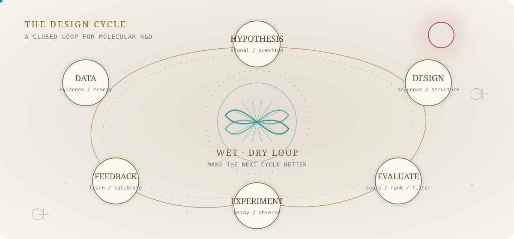
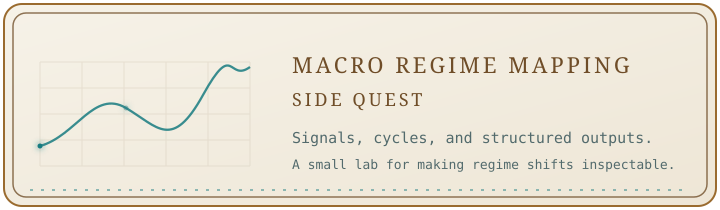
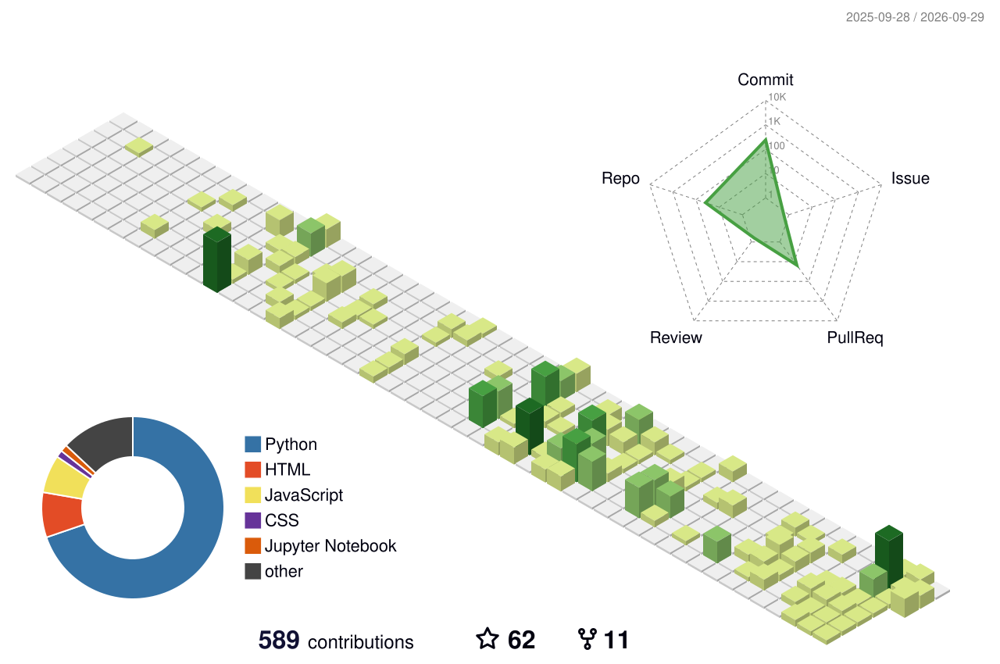

<picture>
  <source media="(prefers-reduced-motion: reduce) and (max-width: 600px)" srcset="./assets/hero-archive-animated-mobile.svg" />
  <source media="(prefers-reduced-motion: reduce)" srcset="./assets/hero-archive-animated.svg" />
  <source media="(max-width: 600px)" srcset="./assets/hero-archive-animated-mobile.svg" />
  
</picture>

<picture>
  <source media="(prefers-color-scheme: dark) and (max-width: 600px)" srcset="./assets/capsule-hero-mobile.svg" />
  <source media="(prefers-color-scheme: light) and (max-width: 600px)" srcset="./assets/capsule-hero-mobile-light.svg" />
  <source media="(prefers-color-scheme: dark)" srcset="./assets/capsule-hero.svg" />
  <source media="(prefers-color-scheme: light)" srcset="./assets/capsule-hero-light.svg" />
  
</picture>

## ☀️ Day

I work at the intersection of **AI and synthetic biology**, building protein and enzyme design workflows that connect computational modeling, experimental validation, and data feedback.

I turn advanced models and atom-level tools into reproducible systems that teams can reuse.

Public entry point: [SynAster Hub](https://syn-aster.bohrium.com/) — a protein-design skill bundle for AI agents.

<picture>
  <source media="(prefers-color-scheme: dark) and (max-width: 600px)" srcset="./assets/research-loop-mobile.svg" />
  <source media="(prefers-color-scheme: light) and (max-width: 600px)" srcset="./assets/research-loop-mobile-light.svg" />
  <source media="(prefers-color-scheme: dark)" srcset="./assets/research-loop.svg" />
  <source media="(prefers-color-scheme: light)" srcset="./assets/research-loop-light.svg" />
  
</picture>

**Small public tools:** [Pipeline Assessment](https://github.com/Ficere/pipeline-assessment) for structured pipeline review · [DummyDocking](https://github.com/Ficere/DummyDocking) for inspectable docking workflows.

## 🌙 Night

<a href="https://github.com/Ficere/tianji">
<picture>
  <source media="(prefers-color-scheme: dark) and (max-width: 600px)" srcset="./assets/tianji-card-mobile.svg" />
  <source media="(prefers-color-scheme: light) and (max-width: 600px)" srcset="./assets/tianji-card-mobile-light.svg" />
  <source media="(prefers-color-scheme: dark)" srcset="./assets/tianji-card.svg" />
  <source media="(prefers-color-scheme: light)" srcset="./assets/tianji-card-light.svg" />
  
</picture>
</a>

<a href="https://github.com/Ficere/macro-regime-mapping">
<picture>
  <source media="(prefers-color-scheme: dark) and (max-width: 600px)" srcset="./assets/macro-regime-card-mobile.svg" />
  <source media="(prefers-color-scheme: light) and (max-width: 600px)" srcset="./assets/macro-regime-card-mobile-light.svg" />
  <source media="(prefers-color-scheme: dark)" srcset="./assets/macro-regime-card.svg" />
  <source media="(prefers-color-scheme: light)" srcset="./assets/macro-regime-card-light.svg" />
  
</picture>
</a>

## ✦ Focus Constellation

<picture>
  <source media="(prefers-color-scheme: dark)" srcset="./assets/generated/tech-stack.svg" />
  <source media="(prefers-color-scheme: light)" srcset="./assets/generated/tech-stack-light.svg" />
  
</picture>

## 🐍 Activity

<picture>
  <source media="(prefers-color-scheme: dark)" srcset="https://raw.githubusercontent.com/Ficere/Ficere/output/github-contribution-grid-snake-dark.svg" />
  <source media="(prefers-color-scheme: light)" srcset="https://raw.githubusercontent.com/Ficere/Ficere/output/github-contribution-grid-snake.svg" />
  
</picture>

<picture>
  <source media="(prefers-color-scheme: dark)" srcset="./assets/profile-3d-contrib/profile-night-view.svg" />
  <source media="(prefers-color-scheme: light)" srcset="./assets/profile-3d-contrib/profile-green.svg" />
  
</picture>

The contribution observatory is refreshed daily by GitHub Actions and remains visible without opening a collapsed section.

## Contact

For conversations around AI for biology, protein engineering, scientific infrastructure, or agentic workflows, reach me through [GitHub](https://github.com/Ficere).

<em>Let experimental data decide the next design; let curiosity decide the next question.</em>

