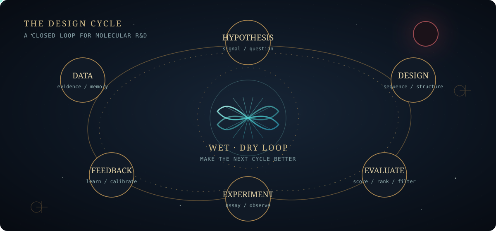

<div align="center">


# AI × Synthetic Biology

**Protein Design · Scientific Platforms**

<p><strong>白天设计蛋白，晚上研究 AI 会不会算命。</strong></p>

[](https://git.io/typing-svg)


<br />


</div>

## 🧬 关于我 · About Me

I lead R&amp;D at the intersection of **AI and synthetic biology**, building systems for protein and enzyme design, validation, and delivery.

My work spans atom-level modeling tools, biological sequence and structure models, scientific workflow integration, and the wet–dry loop that connects computational design with experiments and data feedback.

Today, I focus on turning deep technical work into reproducible capabilities that teams and collaborators can use repeatedly.

<details>
<summary><strong>中文简介 · Chinese note</strong></summary>

我负责 AI 与合成生物学交叉领域的研发，关注蛋白质与酶工程、原子级工具、科研工作流，以及从计算设计到实验验证的数据闭环。

</details>

```yaml
focus: "AI × Synthetic Biology"
domain: "Protein and Enzyme Engineering"
work: "Design → Validation → Data Feedback → Iteration"
role: "R&D Lead"
```

## 🛠️ 研发方向 · Research Areas

- **Protein & enzyme design** — sequence, structure, function, and atom-level tooling.
- **Biological models** — development and evaluation for sequence, structure, and design problems.
- **Wet–dry workflows** — computational design, experimental validation, and data feedback.
- **Scientific platforms** — reproducible infrastructure for teams and collaborators.

## 🔁 研发闭环 · R&amp;D Loop

<div align="center">

<picture>
  <source media="(max-width: 600px)" srcset="./assets/research-loop-mobile.svg" />
  
</picture>

</div>

The goal is not only to generate a promising molecule, but to make the next design cycle faster, more reliable, and easier to reproduce.

<details>
<summary><strong>Loop details · 查看流程细节</strong></summary>

| Stage | Question | Artifact |
|---|---|---|
| Hypothesis | What should be true? | design brief / target profile |
| Molecular Design | What could satisfy it? | sequences / structures / candidates |
| Evaluation | Which candidates deserve attention? | scores / filters / ranking |
| Experiment | What survives contact with reality? | assays / measurements |
| Feedback | What did the system learn? | calibrated data / next hypothesis |

</details>

## 🔬 公开项目 · Selected Public Work

- **[Pipeline Assessment](https://github.com/Ficere/pipeline-assessment)** — An Agent Skill for structured pharmaceutical pipeline and asset assessment.
- **[DummyDocking](https://github.com/Ficere/DummyDocking)** — A compact docking workflow template for inspectable, reproducible structure-based work.
- **[macro-regime-mapping](https://github.com/Ficere/macro-regime-mapping)** — A small research tool for turning macroeconomic signals into structured, explainable outputs.

## 🌙 业余实验室 · After Hours

After hours, I build tools for questions that sit outside my day job. **[tianji](https://github.com/Ficere/tianji)** is an all-in-one fortune-analysis Agent Skill combining traditional Chinese systems, Western astrology, structured computation, schema validation, and static report generation.

## 🧭 工作原则 · Principles

> Let experimental data decide the next design; let curiosity decide the next question.
>
> Complex research becomes a team capability when it can be reproduced.

## 📊 GitHub 活动 · GitHub Activity

<div align="center">
<picture>
  <source media="(prefers-color-scheme: dark)" srcset="https://raw.githubusercontent.com/Ficere/Ficere/output/github-contribution-grid-snake-dark.svg" />
  <source media="(prefers-color-scheme: light)" srcset="https://raw.githubusercontent.com/Ficere/Ficere/output/github-contribution-grid-snake.svg" />
  
</picture>
</div>

## 🤝 合作与交流 · Collaboration

I am open to conversations around **AI for biology, protein and enzyme engineering, scientific infrastructure, agentic workflows, and reproducible R&amp;D**. The simplest way to start is through [GitHub](https://github.com/Ficere) or an issue in the relevant public repository.
