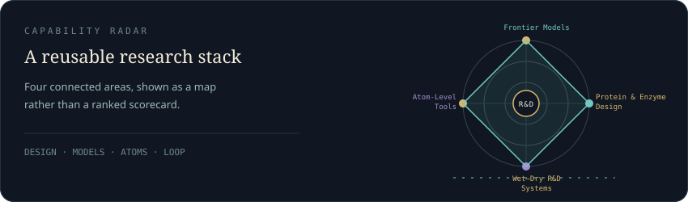
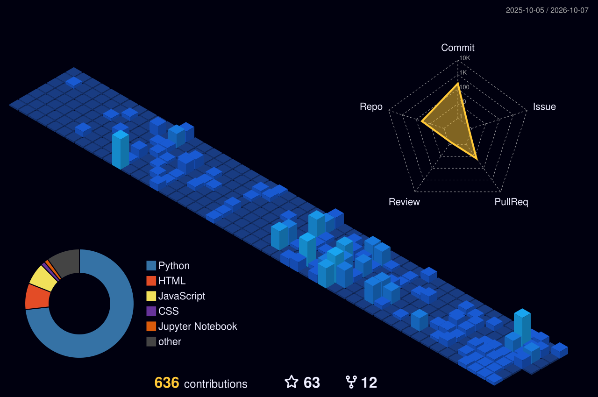

<picture>
  <source media="(prefers-reduced-motion: reduce) and (max-width: 600px)" srcset="./assets/hero-archive-mobile.png" />
  <source media="(prefers-reduced-motion: reduce)" srcset="./assets/hero-archive.png" />
  <source media="(max-width: 600px)" srcset="./assets/hero-archive-animated-mobile.svg" />
  
</picture>

<h1 align="center">AI × Synthetic Biology</h1>

<strong>Designing proteins by day, researching whether AI can tell fortunes by night.</strong>

<strong>Building reproducible R&amp;D systems for protein design.</strong>

<picture>
  <source media="(max-width: 600px)" srcset="./assets/hero-typing-mobile.svg" />
  
</picture>

## ☀️ Day

I work at the intersection of **AI and synthetic biology**, building protein and enzyme design workflows that connect computational modeling, experimental validation, and data feedback.

I turn advanced models and atom-level tools into reproducible systems that teams can reuse.

Public entry point: [SynAster Hub](https://syn-aster.bohrium.com/) — a protein-design skill bundle for AI agents.

<picture>
  <source media="(max-width: 600px)" srcset="./assets/research-loop-mobile.svg" />
  
</picture>

**Small public tools:** [Pipeline Assessment](https://github.com/Ficere/pipeline-assessment) for structured pipeline review · [DummyDocking](https://github.com/Ficere/DummyDocking) for inspectable docking workflows.

Alternative capsule-render banner prototype

<picture>
  <source media="(max-width: 600px)" srcset="./assets/capsule-hero-prototype-mobile.svg" />
  
</picture>

This is a self-hosted prototype generated from [capsule-render](https://github.com/kyechan99/capsule-render). The original star-chart instrument remains the default hero while this alternative is evaluated.

## 🌙 Night

<a href="https://github.com/Ficere/tianji">
<picture>
  <source media="(max-width: 600px)" srcset="./assets/tianji-card-mobile.svg" />
  
</picture>
</a>

**[macro-regime-mapping](https://github.com/Ficere/macro-regime-mapping)** — another small side quest for turning signals into structured outputs.

## ✦ Focus Constellation

  

The constellation is generated from a small, curated configuration. It describes focus areas without exposing private project names or internal metrics.

Generated project constellation

  

## 🐍 Activity

<picture>
  <source media="(prefers-color-scheme: dark)" srcset="https://raw.githubusercontent.com/Ficere/Ficere/output/github-contribution-grid-snake-dark.svg" />
  <source media="(prefers-color-scheme: light)" srcset="https://raw.githubusercontent.com/Ficere/Ficere/output/github-contribution-grid-snake.svg" />
  
</picture>

Open the contribution observatory

  

The 3D view is generated daily by a pinned GitHub Action. The checked-in SVG stays available while the first run or a later refresh is pending.

## Contact

For conversations around AI for biology, protein engineering, scientific infrastructure, or agentic workflows, reach me through [GitHub](https://github.com/Ficere).

<em>Let experimental data decide the next design; let curiosity decide the next question.</em>

